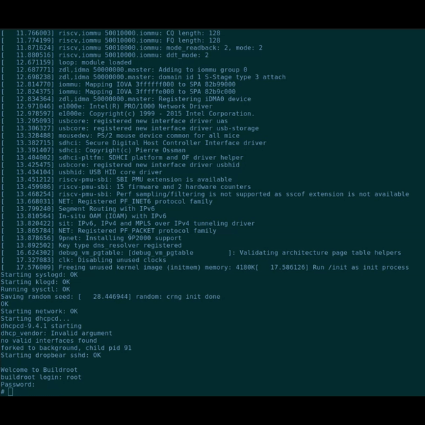
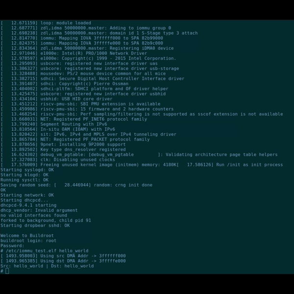

# RISC-V IOMMU Demo

## License

This work is licensed under the Apache-2.0 License. See the [LICENSE](./LICENSE) file for more details.

## Table of Contents

- [About the Demo](#about-the-demo)
    - [Tools and Versions](#tools-and-versions)
- [Synthesizing the RTL Design](#synthesizing-the-rtl-design)
- [Building the Demos](#building-the-demos)
    - [Demo #1: Linux w/ IOMMU](#demo-1-linux-w-risc-v-iommu)
    - [Demo #2: Bao Hypervisor and Guest Attacker](#demo-2-bao-hypervisor-and-guest-attacker)
- [Copying the image to an SD card](#copying-the-image-to-an-sd-card)
- [Running the Demo](#running-the-demo)
    - [Running Demo #1: Linux w/ IOMMU](#running-demo-1-linux-w-iommu)
    - [Running Demo #2: Bao Hypervisor and Guest Attacker](#running-demo-2-bao-hypervisor-and-guest-attacker)

***

## About the Demo

This repository contains source code and instructions to build and run two functional demos of the [RISC-V IOMMU IP](https://github.com/zero-day-labs/riscv-iommu) developed by the Zero-Day Labs. Both demos are carried out in a Genesys2 FPGA board, and run atop a CVA6-based SoC with support for the RISC-V Hypervisor extension, integrating one [DMA device](https://github.com/pulp-platform/iDMA) and the RISC-V IOMMU IP. 

- **Demo #1** consists of a tutorial to run Linux atop the target platform, using the RISC-V IOMMU Linux driver developed by the RISC-V IOMMU task group. We provide a simple application to issue DMA transfers using both mapped and unmapped addresses.

- In **Demo #2**, we show the operation of the IOMMU within a virtualized environment. In this demo, the DMA device is programmed to tamper critical memory regions of higher privileged SW: [Bao hypervisor](https://github.com/bao-project/bao-hypervisor) or [OpenSBI](https://github.com/riscv-software-src/opensbi) (firmware). The IOMMU IP is enabled by default, but it can be disabled to demonstrate the side-effects (for system level isolation) of the absense of the IOMMU IP. The user navigates through the demo using the push buttons in the board, and the output is printed to the console.

### Tools and Versions

To build and run the demo we used the following tools:

| Requirement | Version | Used to |
| - | - | - |
| Vivado | 2022.2 | Synthesize RTL design and generate bitstream |
| [riscv-tools](https://github.com/riscv-software-src/riscv-tools) | - | Synthesize RTL design |
| [riscv64-linux-gnu-gcc](https://packages.ubuntu.com/search?keywords=gcc-riscv64-linux-gnu) | 9.4.0 (RISC-V GNU GCC - Ubuntu pkg) | Build Linux |
| [riscv64-unknown-elf-gcc](https://static.dev.sifive.com/dev-tools/freedom-tools/v2020.08/riscv64-unknown-elf-gcc-10.1.0-2020.08.2-x86_64-linux-ubuntu14.tar.gz) | 10.1.0 (SiFive GCC) | Build Bao hypervisor and baremetal guest |
| [riscv64-unknown-linux-gnu-gcc](https://github.com/riscv-collab/riscv-gnu-toolchain/releases/tag/2021.08.11) | 12.2.0 (RISC-V GNU GCC) | Build OpenSBI |

## Synthesizing the RTL Design

First of all, clone this repository and load all git submodules:

```bash
git clone git@github.com:zero-day-labs/riscv-iommu-demo.git
cd riscv-iommu-demo
git submodule update --init --recursive
```

Both demos use the same hardware design. So, the first step is to synthesize the RTL code using Vivado. For this purpose, you need to point the `RISCV` environment variable to the path where your [riscv-tools](https://github.com/riscv-software-src/riscv-tools) instalation is located.

```bash
export RISCV=/path/to/riscv_tools
```

Then, to synthesize the RTL design of the CVA6-based SoC with the IOMMU IP and generate the bitstream, run from the top directory of the repo:
```bash
make -C cva6 fpga
```
:warning: In order to synthesize the RTL design, you must have the required licenses installed in Vivado. Otherwise, the run will fail.

At the end, the bitstream is located at **cva6/corev_apu/fpga/work-fpga/ariane_xilinx.bit**

## Building the demos

Before changing the target demo, make sure to clean the build:

```bash
make -C linux ARCH=riscv mrproper && \
make -C linux/tools/lloader clean && \
make -C bao-baremetal-guest clean && \
make -C bao-hypervisor clean && \
make -C opensbi clean
```

### Demo #1: Linux w/ RISC-V IOMMU

1. Build the Linux kernel with the RISC-V IOMMU driver:

```bash
make -C linux ARCH=riscv CROSS_COMPILE=riscv64-linux-gnu- KBUILD_DEFCONFIG=defconfig O=build -j$(nproc) defconfig Image
```
:information_source: We provide a pre-built filesystem generated with Buildroot in [linux/fs/cva6/](./linux/fs/cva6/). This FS is passed to the Kernel in the build configuration files, and contains a user-space application to perform DMA transfers within Linux

2. Compile the device tree:

```bash
cd linux/arch/riscv/boot/dts/cva6 && dtc cva6-ariane-minimal.dts > cva6-ariane-minimal.dtb
```

3. Go back to the top directory of the repo and merge the DTB with the Linux image:

```bash
cd ../../../../../.. && make -C linux/tools/lloader CROSS_COMPILE=riscv64-unknown-elf- ARCH=rv64 IMAGE=../../build/arch/riscv/boot/Image DTB=../../arch/riscv/boot/dts/cva6/cva6-ariane-minimal.dtb TARGET=linux-rv64-cva6
```

4. Build OpenSBI and generate the payload firmware:

```bash
make -C opensbi CROSS_COMPILE=riscv64-unknown-linux-gnu- PLATFORM=fpga/ariane FW_PAYLOAD=y FW_PAYLOAD_PATH=../linux/tools/lloader/linux-rv64-cva6.bin
```
The output files (**fw_payload.bin** and **fw_payload.elf**) should be in `opensbi/build/platform/fpga/ariane/firmware/`

### Demo #2: Bao Hypervisor and Guest Attacker

1. Build the baremetal guest:

```bash
make -C bao-baremetal-guest CROSS_COMPILE=riscv64-unknown-elf- PLATFORM=cva6
```
>:information_source: You can skip steps 2 and 3 if you have previously built **Demo #2**

2. In the VM configuration ([vm-configs/cva6-baremetal/config.c](./vm-configs/cva6-baremetal/config.c) file), line 3, set the **absolute** path to the VM image generated in **bao-baremetal-guest/build/cva6/baremetal.bin**, i.e.:

```
VM_IMAGE(baremetal_image, XSTR(/absolute/path/to/baremetal.bin));
```

3. Copy the VM configuration and the platform configuration to the Bao hypervisor directory:

```bash
cp -R vm-configs/* bao-hypervisor/configs && \
cp -R plat-configs/* bao-hypervisor/src/platform/
```

4. Build Bao:

```bash
make -C bao-hypervisor CROSS_COMPILE=riscv64-unknown-elf- PLATFORM=cva6 CONFIG=cva6-baremetal CONFIG_BUILTIN=y
```

5. Build OpenSBI and generate the payload firmware:

```bash
make -C opensbi CROSS_COMPILE=riscv64-unknown-linux-gnu- PLATFORM=fpga/ariane FW_PAYLOAD=y FW_PAYLOAD_PATH=../bao-hypervisor/bin/cva6/cva6-baremetal/bao.bin
```

The output files (**fw_payload.bin** and **fw_payload.elf**) should be in `opensbi/build/platform/fpga/ariane/firmware/`

## Copying the image to an SD card

After building the corresponding demo, you have to copy the output binary file to an SD card in order to run the demo on the *Genesys2* board

1. Insert an SD card into your computer and ***carefully*** identify the dev file associated to your SD Card (e.g., /dev/sda, /dev/mmcblk).
```bash
sudo fdisk -l
```

2. Format the SD card. Replace *\<dev_file\>* with the dev file you identfied in step 1. 
```bash
sudo sgdisk --clear --new=1:2048:+32M --new=2 --typecode=1:3000 --typecode=2:8300 <dev_file> -g
```
:information_source: If you are willing to run **Demo #2**, you can speed up the loading of the image by assigning a lower size to the  the first (BOOT) partition of the SD card (e.g., 4 MiB). To do this, replace **32M** with the size you pretend to use.

3. Copy the binary file to the SD card. Again, replace *\<dev_file\>* with the dev file you identfied in step 1. 
```bash
sudo dd if=opensbi/build/platform/fpga/ariane/firmware/fw_payload.bin of=<dev_file> oflag=sync bs=1M
```

## Running the Demo

1. Insert the SD Card with the binary file into the Genesys2 board.
2. Connect two USB cables to the board: one to the port labelled **UART** and another to the one labelled **JTAG**.
3. Power on the board so that the UART interface used (e.g. /dev/ttyUSB0) becomes available.
4. Open a console with 115200-8-N-1 and connect to the created interface. If there are multiple ttyUSB devices just open a console to each of them.
5. Link the Vivado Hardware Manager to the board.
6. Program the device with the generated bitstream (**cva6/corev_apu/fpga/work-fpga/ariane_xilinx.bit**).

Once programming is finished (around 10s), the boot image will be copied from the SD card to the board. Then, the demo will start executing.

### Running Demo #1: Linux w/ IOMMU



Note the **iommu** and **idma** messages in the Linux boot log. We create two DMA mappings for the device: one for reads (source) and another for writes (destination). After the boot process is complete, login using the word "**root**" as user and password.

You can perform DMA transfers using the user-space application provided within the filesystem:

```
/etc/iommu_test.elf <short_word>
```

This application will copy the provided word into the DMA source buffer, and start two subsequent DMA transfers: one to read the word from the source buffer and another to write it to the DMA destination buffer. At the end, the application prints the provided word and the contents of the destination buffer.



Additionally, you can configure the DMA driver to use unmapped addresses and see what happens:

```
echo 1 > /sys/module/idma/parameters/use_unmapped_addr
```
```
/etc/iommu_test.elf <short_word>
```

A page fault is generated, and the IOMMU raises an interrupt to notice Linux about the error. The fault record include relevant parameters of the DMA transfer (e.g., IO Virtual Address, device ID, fault code).

### Running Demo #2: Bao Hypervisor and Guest Attacker

The Guest VM will start executing immediately after the image is loaded to the board. The console will guide you through the demo using the board push buttons. 

You have the option to attack Bao or OpenSBI (firmware), with the IOMMU enabled or disabled. When the IOMMU is enabled, Bao will print fault messages (warnings) for each DMA transfer.

- Attacking OpenSBI


- Attacking Bao

